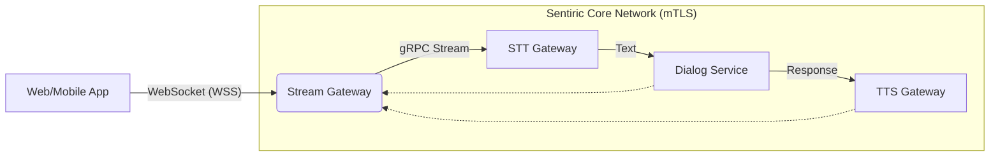

# 🌊 Sentiric Stream Gateway Service

[]()
[]()
[]()

**Sentiric İletişim İşletim Sistemi**'nin dijital dünyadaki giriş kapısıdır. Web, Mobil ve IoT cihazlarından gelen **WebSocket** tabanlı ses ve metin trafiğini karşılar, iç ağdaki yapay zeka motorlarına (STT, LLM, TTS) güvenli bir şekilde dağıtır.

## 🎯 Temel Sorumluluklar

1.  **Protokol Dönüşümü:** Dış dünyadan gelen `WebSocket` akışlarını, iç dünyadaki `gRPC` (Protobuf) akışlarına çevirir.
2.  **Oturum Yönetimi (Stateful):** Her bağlantı için benzersiz bir `SessionID` üretir ve tüm mikroservis zinciri boyunca bu izi sürer (Traceability).
3.  **Orkestrasyon:** Ses verisini STT'ye, oradan dönen metni Dialog servisine, Dialog'dan gelen cevabı TTS'e ileten boru hattını (Pipeline) yönetir.
4.  **Dayanıklılık (Resilience):** `Lazy Connection` mimarisi sayesinde, arka plandaki servisler kapalı olsa bile ağ geçidi ayakta kalır.

## 🏗️ Mimari



## 🚀 Kurulum ve Çalıştırma

### Gereksinimler
*   Docker & Docker Compose
*   `sentiric-certificates` (Bir üst dizinde bulunmalı)

### Geliştirme Ortamı
```bash
make up    # Servisi başlatır (http://localhost:18030)
make logs  # Logları izler
make test  # Birim testleri çalıştırır
```

### Konfigürasyon (.env)
| Değişken | Varsayılan | Açıklama |
|---|---|---|
| `STREAM_GATEWAY_SERVICE_HTTP_PORT` | `18030` | WebSocket dinleme portu |
| `STT_GATEWAY_GRPC_URL` | `https://stt-gateway-service:15021` | STT Servis Adresi |
| `DIALOG_SERVICE_GRPC_URL` | `https://dialog-service:12061` | Dialog Servis Adresi |
| `TTS_GATEWAY_GRPC_URL` | `https://tts-gateway-service:14011` | TTS Servis Adresi |

## 🧪 Test Arayüzü
Servis ayağa kalktığında tarayıcınızdan `http://localhost:18030` adresine giderek mikrofon destekli test arayüzüne erişebilirsiniz.